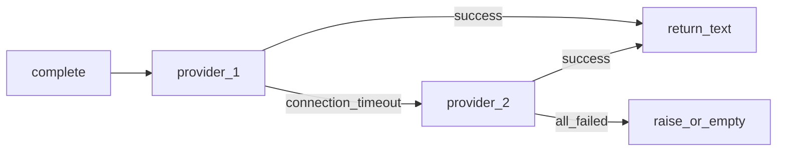

<!-- 0199f577-0908-489d-accf-325519bc8876 -->
---
todos:
  - id: "schema-config"
    content: "Definir estructura YAML llm_chain + ejemplo OpenAI/OpenRouter; parsear en config.py con defaults por campo"
    status: pending
  - id: "env-resolve"
    content: "Resolver api_key_env desde os.environ al arranque; fallar con mensaje claro si falta variable"
    status: pending
  - id: "llm-chain-client"
    content: "Implementar cadena en llm.py: complete() con fallback en APIConnectionError/APITimeoutError (+ política auth)"
    status: pending
  - id: "wire-main"
    content: "En __main__.py elegir LLMChain vs LLMClient según presencia de llm_chain; mantener fallback env-only"
    status: pending
  - id: "docs-example"
    content: "Actualizar README y .env.example; añadir config.example o bloque documentado"
    status: pending
isProject: false
---
# Plan: cadena de proveedores LLM (OpenAI / OpenRouter)

Este documento vive en la raíz del repositorio (`LLM_PROVIDER_CHAIN_PLAN.md`) para poder ejecutar el trabajo sin depender de `.cursor/plans/`.

## Contexto actual

- [`ultron/llm.py`](ultron/llm.py): un solo `LLMClient` con `AsyncOpenAI`, `complete(system, user)`.
- [`ultron/__main__.py`](ultron/__main__.py): construye `LLMClient` solo desde [`ultron/settings.py`](ultron/settings.py) (`LLM_BASE_URL`, `LLM_API_KEY`, `LLM_MODEL`, `LLM_TIMEOUT_SECONDS`, `LLM_MAX_RETRIES`).
- [`ultron/config.py`](ultron/config.py) + [`config.yaml`](config.yaml): no definen LLM hoy; solo Discord, reports, schedules, logging.

## Diseño de configuración (YAML + `.env`)

- **Lista ordenada** en `config.yaml` (cada instalación su copia; en el repo solo **ejemplo** no secreto, p. ej. `config.example.yaml` o bloque documentado en README):

```yaml
llm_chain:
  - id: openai_primary
    base_url: "https://api.openai.com/v1"
    model: gpt-4o-mini
    api_key_env: OPENAI_API_KEY
    timeout_seconds: 120
    max_retries: 2
  - id: openrouter_backup
    base_url: "https://openrouter.ai/api/v1"
    model: openai/gpt-4o-mini
    api_key_env: OPENROUTER_API_KEY
    timeout_seconds: 180
    max_retries: 1
```

- **Jerarquía** = orden del array (primero = intento principal, siguiente = fallback).
- **Secretos**: solo **`api_key_env`** (nombre de variable); valores reales en **`.env`** (no en YAML). Opcional: documentar en [`.env.example`](.env.example) nombres de variables sin valores.
- **Por proveedor**: `timeout_seconds` y `max_retries` por entrada (OpenAI vs OpenRouter pueden diferir).
- **Retrocompatibilidad**: si **`llm_chain` está ausente o vacío**, seguir usando el comportamiento actual (`LLM_*` en env) para no romper despliegues existentes.

## Resolución en arranque

- Tras `load_config`, si hay `llm_chain`:
  - Para cada entrada, leer `os.environ[api_key_env]`; si falta, error claro al iniciar (sin imprimir la key).
  - Construir internamente una lista de “slots” listos para crear cliente(s) SDK.
- Opcional: validar `base_url` (no vacío, esquema http/https).

## Capa LLM en código

- Nuevo tipo (nombre orientativo) **`LLMChainClient`** o extender **`LLMClient`** con modo cadena:
  - Mantener la firma pública **`async def complete(self, *, system: str, user: str) -> str`** para que [`ultron/workflows.py`](ultron/workflows.py) y el bot no cambien de forma invasiva.
  - Por intento: instanciar `AsyncOpenAI` con `base_url`, `api_key`, `timeout`, `max_retries` de esa entrada (o reutilizar clientes en caché por `id`).
  - **Fallback ante errores transitorios**: capturar `openai.APIConnectionError`, `openai.APITimeoutError`, y opcionalmente rate-limit / 5xx si el SDK las expone de forma uniforme; **log** con `id` del proveedor (nunca la key); pasar al siguiente.
  - **401 / auth**: decidir política explícita (p. ej. no reintentar con otro proveedor si la key del primero es inválida, o sí si se quiere “backup key”; documentar en README).
  - Si todos fallan: propagar el último error o un error agregado; el bot ya muestra mensajes genéricos al usuario en varios sitios.



## Cableado

- [`ultron/__main__.py`](ultron/__main__.py): si `app_cfg` incluye cadena resuelta, construir el cliente encadenado; si no, `LLMClient` actual desde `load_env()`.
- [`ultron/config.py`](ultron/config.py): parsear `llm_chain` en dataclasses (p. ej. `LLMProviderEntry`, `LLMChainConfig` opcional dentro de `AppConfig` o objeto hermano retornado junto a `AppConfig` para no mezclar demasiado; lo más simple es **añadir campo opcional** `llm_chain: tuple[LLMProviderEntry, ...]` a `AppConfig` o contenedor dedicado).

## Documentación y ejemplos

- **README**: sección corta (cadena, env vars, orden = prioridad, fallback).
- **Ejemplos**: solo **OpenAI** y **OpenRouter** en el YAML de ejemplo (sin Cursor Agent).
- **No implementar** adaptadores no OpenAI-compat en este plan.

## Archivos principales a tocar (implementación futura)

| Área | Archivo(s) |
|------|------------|
| Esquema + load | [`ultron/config.py`](ultron/config.py), ejemplo en repo |
| Cliente + fallback | [`ultron/llm.py`](ultron/llm.py) |
| Arranque | [`ultron/__main__.py`](ultron/__main__.py) |
| Docs | [`README.md`](README.md), [`.env.example`](.env.example) |

## Fuera de alcance

- Integración **Cursor Agent** u otros no HTTP/OpenAI-compat.
- Cambiar el formato de prompts o el contrato de `workflows` más allá de seguir usando `complete()`.
