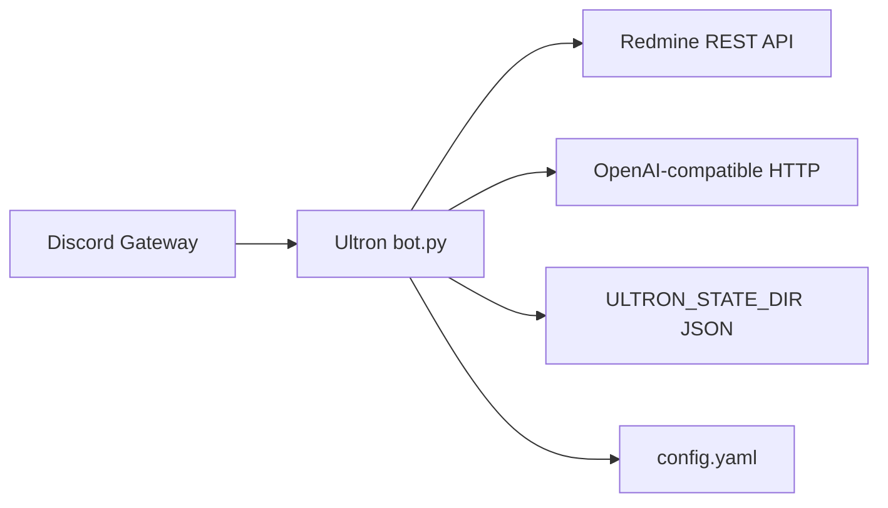

# Ultron — operations and integration

This document is for **people who deploy and run** the bot on a host. End users in Discord should read [USER_GUIDE.md](USER_GUIDE.md).

## Integration overview



| System | Role in Ultron | Code references |
|--------|----------------|-----------------|
| **Discord** | Slash commands, @mention chat replies, optional log channel | [`ultron/bot.py`](../ultron/bot.py), intents in `UltronBot.__init__` |
| **Redmine** | Issues, journals, REST | [`ultron/redmine.py`](../ultron/redmine.py) — e.g. `GET /users/current.json` at startup |
| **LLM** | `/summary`, `/ask_issue`, `/note`, NL @mention routing | [`ultron/llm.py`](../ultron/llm.py), [`ultron/workflows.py`](../ultron/workflows.py), [`ultron/nl_router.py`](../ultron/nl_router.py) |
| **Scheduled listings** | `report_schedule` → same markdown as slash list commands | [`ultron/report_schedule.py`](../ultron/report_schedule.py), [`ultron/redmine_listings.py`](../ultron/redmine_listings.py) |
| **Environment** | Secrets and paths | [`ultron/settings.py`](../ultron/settings.py) — `load_env()` |
| **YAML** | Schedules, Discord copy, `llm_chain` | [`ultron/config.py`](../ultron/config.py) — `load_config()` |

## Environment validation (`load_env`)

Implemented in [`ultron/settings.py`](../ultron/settings.py):

- **Always required:** `DISCORD_TOKEN`, `REDMINE_URL`, `REDMINE_API_KEY`.
- **LLM optional:** If there is no usable `llm_chain` in `config.yaml` and no API key / Ollama-style defaults, `llm_enabled` is **false** — the bot still starts; `/summary`, `/ask_issue`, and `/note` are rejected with a clear message.
- **Conflict:** `LLM_DISABLED` / `ULTRON_NO_LLM` cannot be set together with a non-empty `llm_chain` (startup error).

Paths:

- **`CONFIG_PATH`** — YAML file (default `./config.yaml` relative to the process working directory).
- **`ULTRON_STATE_DIR`** — Whitelist, admins, pending tokens (`whitelist.json`, `admins.json`, etc.).

## Redmine

- Startup calls **`RedmineClient.verify_connection()`** → `GET /users/current.json` (see [`ultron/redmine.py`](../ultron/redmine.py)). Failure aborts startup.
- API key is sent as **`X-Redmine-API-Key`**.

## Discord

- **Slash commands** need **guilds**. **@mention** handling uses **guild_messages** + **dm_messages** (non-privileged) so `on_message` runs. The optional **`DISCORD_MESSAGE_CONTENT_INTENT=1`** adds the privileged **message_content** intent (must match the Developer Portal); enable it if Discord does not populate `mentions` without it.
- Logs: slash traffic is tagged **`source=slash`** (`ultron.commands`); chat mentions use **`source=chat`** (`ultron.chat`). The console formatter prints a colored **`[phase]`** prefix immediately after the level (from `extra.slash_phase` or `extra.chat_phase`): slash **`INPUT`** / **`OUTPUT`** / **`ERROR`** / **`DENIED`**; chat **`RECEIVED`**, **`INPUT`**, **`OUTPUT`**, **`ERROR`**, **`IGNORE`**, and **`ROUTER`** (NL pipeline: classified, command_accepted, dispatch). The message body then carries `source=…`, ids, and **`feature=`** where relevant. **Admin** commands are never executed from chat (code-enforced).
- **`DISCORD_GUILD_ID`** — On startup, Ultron **syncs slash commands to this guild** (instant updates for members in that server), then **syncs globally** so the same definitions apply in DMs and other guilds (Discord may take up to ~1 hour for the global side). If **unset or empty**, the default guild id is **788074756044750891**. Set **`0`** or **`global`** for **global-only** sync (no guild-specific copy). If **`/summary`** (or similar) still shows only **`issue_id`**, confirm you are testing **inside the configured guild** and check startup logs for `Registered LLM slash command variant` and sync lines; optional LLM parameters are easy to miss in the client UI (scroll the slash form).
- **`DISCORD_ADMIN_IDS`** — Merged with `admins.json` under `ULTRON_STATE_DIR` for `/approve`, `/remove`, `/show_config`.

### Logs and scheduled posts

- **`discord.registration_log`** in `config.yaml` — Optional Discord channel on startup (when `features.startup`): LLM-disabled notice if applicable, and a short **online** line **only** when **`reports.startup_message_enabled`** is false or **`reports.channel_id`** is `0` (so the same sentence is not posted twice when the reports channel already sends its welcome). Whitelist events use `features.whitelist_events`. This is **not** the Redmine digest channel unless you deliberately use the same id.
- **`reports.channel_id`** — Channel for **`report_schedule`** jobs and the optional startup welcome/summary. `0` disables **all** of that (no welcome post, no scheduled listings). If you set jobs in **`report_schedule`** but leave **`reports.channel_id`** at `0`, nothing is posted — check logs for a warning.
- **`report_schedule`** — List of `{ command, interval_hours | interval_days, args }` (see `config.example.yaml`). Commands: `list_new_issues` (legacy YAML alias: `new_issues`), `list_unassigned_issues` (legacy alias: `unassigned_issues`), `issues_by_status` (requires `args.status`). The bot runs an hourly loop and runs a job when **`interval_hours`** have elapsed since its last successful run (or since startup for that job). The **startup welcome** (when `reports.startup_message_enabled` is true) is a separate one-time post when the bot becomes ready; the first **issue-list** digest still waits until the interval passes unless you shorten `interval_hours` for testing.

## Configuration wizard

Interactive setup (optional extra):

```bash
pip install -e ".[wizard]"
ultron wizard
```

See [README.md — Configuration wizard](../README.md#configuration-wizard-terminal). Implementation lives under [`ultron/wizard/`](../ultron/wizard/).

## YAML validation

- Parsing and defaults: [`ultron/config.py`](../ultron/config.py) (`load_config`). Invalid YAML or invalid `llm_chain` entries raise **`ValueError`** at startup.
- Reference template: [`config.example.yaml`](../config.example.yaml).

## Health checks

- **Startup:** Log lines include Redmine OK / LLM backend (or none). Optional line to `registration_log` when enabled.
- **Smoke script (no Discord):** [`scripts/smoke_check.py`](../scripts/smoke_check.py) — optional Redmine/LLM connectivity from `.env`.

## Related documentation

- [RELEASE_CHECKLIST.md](RELEASE_CHECKLIST.md) — what to verify before tagging a release.
- [README.md](../README.md) — full env table, slash commands, Docker.
