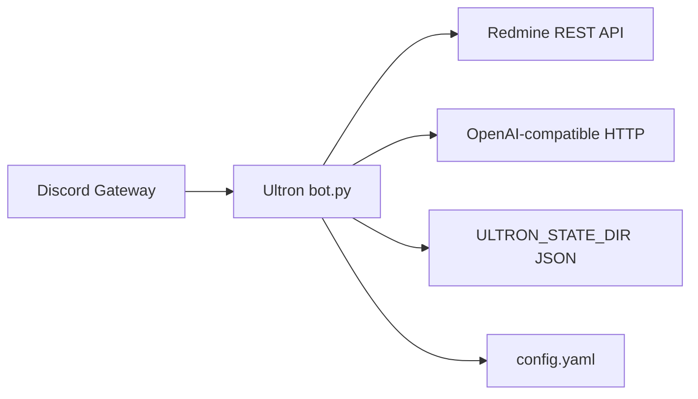

# Ultron — operations and integration

This document is for **people who deploy and run** the bot on a host. End users in Discord should read [USER_GUIDE.md](USER_GUIDE.md).

## Integration overview



| System | Role in Ultron | Code references |
|--------|----------------|-----------------|
| **Discord** | Slash commands, @mention chat replies, optional log channel | [`ultron/bot.py`](../ultron/bot.py), intents in `UltronBot.__init__` |
| **Redmine** | Issues, journals, REST | [`ultron/redmine.py`](../ultron/redmine.py) — e.g. `GET /users/current.json` at startup |
| **LLM** | `/summary`, `/ask_issue`, `/note`, NL @mention routing, scheduled report prose | [`ultron/llm.py`](../ultron/llm.py), [`ultron/workflows.py`](../ultron/workflows.py), [`ultron/jobs.py`](../ultron/jobs.py), [`ultron/nl_router.py`](../ultron/nl_router.py) |
| **Environment** | Secrets and paths | [`ultron/settings.py`](../ultron/settings.py) — `load_env()` |
| **YAML** | Schedules, Discord copy, `llm_chain` | [`ultron/config.py`](../ultron/config.py) — `load_config()` |

## Environment validation (`load_env`)

Implemented in [`ultron/settings.py`](../ultron/settings.py):

- **Always required:** `DISCORD_TOKEN`, `REDMINE_URL`, `REDMINE_API_KEY`.
- **LLM optional:** If there is no usable `llm_chain` in `config.yaml` and no API key / Ollama-style defaults, `llm_enabled` is **false** — the bot still starts; `/summary`, `/ask_issue`, and `/note` are rejected with a clear message.
- **Conflict:** `LLM_DISABLED` / `ULTRON_NO_LLM` cannot be set together with a non-empty `llm_chain` (startup error).

Paths:

- **`CONFIG_PATH`** — YAML file (default `./config.yaml` relative to the process working directory).
- **`ULTRON_STATE_DIR`** — Whitelist, admins, pending tokens (`whitelist.json`, `admins.json`, etc.).

## Redmine

- Startup calls **`RedmineClient.verify_connection()`** → `GET /users/current.json` (see [`ultron/redmine.py`](../ultron/redmine.py)). Failure aborts startup.
- API key is sent as **`X-Redmine-API-Key`**.

## Discord

- **Slash commands** need **guilds**. **@mention** handling uses **guild_messages** + **dm_messages** (non-privileged) so `on_message` runs. The optional **`DISCORD_MESSAGE_CONTENT_INTENT=1`** adds the privileged **message_content** intent (must match the Developer Portal); enable it if Discord does not populate `mentions` without it.
- Logs: slash traffic is tagged **`source=slash`** (`ultron.commands`); chat mentions use **`source=chat`** (`ultron.chat`). Mention traffic is further tagged for filtering: **`[RECEIVED]`** (every addressed message), **`[IGNORE]`** (not whitelisted), **`[INPUT]`** / **`[OUTPUT]`** / **`[ERROR]`** (work on a mention), plus **`feature=`** (e.g. `nl_router`, `nl_disabled`). Natural-language routing logs **`nl_router | classified`**, **`nl_router | command_accepted`** (model chose an allowed command), and **`nl_router | dispatch`**; **admin** commands are never executed from chat (code-enforced).
- **`DISCORD_GUILD_ID`** — If set, commands are **synced to that guild** on startup (fast updates during development). If unset, **global** sync applies (can take up to ~1 hour to appear everywhere).
- **`DISCORD_ADMIN_IDS`** — Merged with `admins.json` under `ULTRON_STATE_DIR` for `/approve`, `/remove`, `/show_config`.

### Logs and scheduled posts

- **`discord.registration_log`** in `config.yaml` — Optional Discord channel for startup lines and whitelist events (`registration_log.channel_id`, `features.*`).
- **`reports.channel_id`** — Channel for **scheduled** abandoned / stale-new reports. `0` disables those loops.

## Configuration wizard

Interactive setup (optional extra):

```bash
pip install -e ".[wizard]"
ultron wizard
```

See [README.md — Configuration wizard](../README.md#configuration-wizard-terminal). Implementation lives under [`ultron/wizard/`](../ultron/wizard/).

## YAML validation

- Parsing and defaults: [`ultron/config.py`](../ultron/config.py) (`load_config`). Invalid YAML or invalid `llm_chain` entries raise **`ValueError`** at startup.
- Reference template: [`config.example.yaml`](../config.example.yaml).

## Health checks

- **Startup:** Log lines include Redmine OK / LLM backend (or none). Optional line to `registration_log` when enabled.
- **Smoke script (no Discord):** [`scripts/smoke_check.py`](../scripts/smoke_check.py) — optional Redmine/LLM connectivity from `.env`.

## Related documentation

- [RELEASE_CHECKLIST.md](RELEASE_CHECKLIST.md) — what to verify before tagging a release.
- [README.md](../README.md) — full env table, slash commands, Docker.
