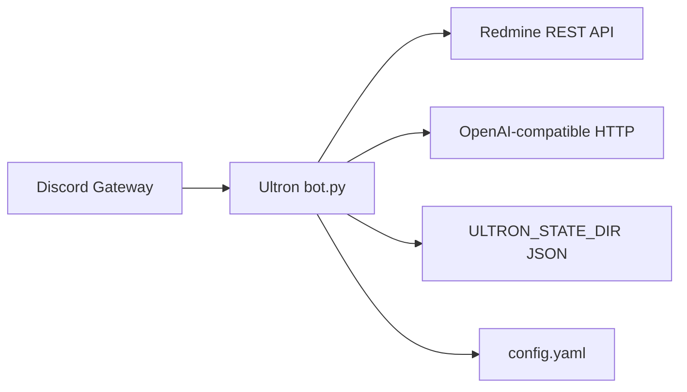

# Ultron — operations and integration

This document is for **people who deploy and run** the bot on a host. End users in Discord should read [USER_GUIDE.md](USER_GUIDE.md).

## Integration overview



| System | Role in Ultron | Code references |
|--------|----------------|-----------------|
| **Discord** | Slash commands, @mention chat replies, optional log channel | [`ultron/bot.py`](../ultron/bot.py), intents in `UltronBot.__init__` |
| **Redmine** | Issues, journals, REST | [`ultron/redmine.py`](../ultron/redmine.py) — e.g. `GET /users/current.json` at startup |
| **LLM** | `/summary`, `/ask_issue`, `/note`, NL @mention routing | [`ultron/llm.py`](../ultron/llm.py), [`ultron/workflows.py`](../ultron/workflows.py), [`ultron/nl_router.py`](../ultron/nl_router.py) |
| **Scheduled listings** | `report_schedule` → same markdown as slash list commands | [`ultron/report_schedule.py`](../ultron/report_schedule.py), [`ultron/redmine_listings.py`](../ultron/redmine_listings.py) |
| **Environment** | Secrets and paths | [`ultron/settings.py`](../ultron/settings.py) — `load_env()` |
| **YAML** | Schedules, Discord copy, `llm_chain` | [`ultron/config.py`](../ultron/config.py) — `load_config()` |

## Environment validation (`load_env`)

Implemented in [`ultron/settings.py`](../ultron/settings.py):

- **Config first:** `load_env()` loads `config.yaml` (see **`CONFIG_PATH`** below), then reads the process environment using **names** from optional top-level **`environment_bindings`** (defaults match `.env.example`). Only **`CONFIG_PATH`** is read before YAML.
- **Always required (by default via those names):** `DISCORD_TOKEN`, `REDMINE_URL`, `REDMINE_API_KEY`.
- **LLM optional:** If there is no usable `llm_chain` in `config.yaml` (empty, omitted, or all entries disabled), `llm_enabled` is **false** — the bot still starts; `/summary`, `/ask_issue`, and `/note` are rejected with a clear message.
- **Conflict:** `LLM_DISABLED` / `ULTRON_NO_LLM` (or the names set in `environment_bindings`) cannot be set together with a non-empty `llm_chain` (startup error).

Paths:

- **`CONFIG_PATH`** — YAML file (default `./config.yaml` relative to the process working directory); bootstrap only, not remapped by `environment_bindings`.
- **`ULTRON_STATE_DIR`** — Whitelist, admins, pending tokens (`whitelist.json`, `admins.json`, etc.); default env name is overridable via `environment_bindings.ultron_state_dir_env`.

## Redmine

- Startup calls **`RedmineClient.verify_connection()`** → `GET /users/current.json` (see [`ultron/redmine.py`](../ultron/redmine.py)). Failure aborts startup.
- API key is sent as **`X-Redmine-API-Key`**.

## Discord

- **Slash commands** need **guilds**. **@mention** handling uses **guild_messages** + **dm_messages** (non-privileged) so `on_message` runs. The optional **`DISCORD_MESSAGE_CONTENT_INTENT=1`** adds the privileged **message_content** intent (must match the Developer Portal); enable it if Discord does not populate `mentions` without it.
- Logs: slash traffic is tagged **`source=slash`** (`ultron.commands`); chat mentions use **`source=chat`** (`ultron.chat`). The console formatter prints a colored **`[phase]`** prefix immediately after the level (from `extra.slash_phase` or `extra.chat_phase`): slash **`INPUT`** / **`OUTPUT`** / **`ERROR`** / **`DENIED`**; chat **`RECEIVED`**, **`INPUT`**, **`OUTPUT`**, **`ERROR`**, **`IGNORE`**, and **`ROUTER`** (NL pipeline: classified, command_accepted, dispatch). The message body then carries `source=…`, ids, and **`feature=`** where relevant. **Admin** commands are never executed from chat (code-enforced).
- **`DISCORD_GUILD_ID`** — On startup, Ultron **syncs slash commands to this guild** (instant updates for members in that server), then **syncs globally** so the same definitions apply in DMs and other guilds (Discord may take up to ~1 hour for the global side). If **unset or empty**, the default guild id is **788074756044750891**. Set **`0`** or **`global`** for **global-only** sync (no guild-specific copy). If **`/summary`** (or similar) still shows only **`issue_id`**, confirm you are testing **inside the configured guild** and check startup logs for `Registered LLM slash command variant` and sync lines; optional LLM parameters are easy to miss in the client UI (scroll the slash form).
- **`DISCORD_ADMIN_IDS`** — Merged with `admins.json` under `ULTRON_STATE_DIR` for `/approve`, `/remove`, `/show_config`.

### Logs and scheduled posts

- **`discord.registration_log`** in `config.yaml` — Optional Discord channel on startup (when `features.startup`): LLM-disabled notice if applicable, and a short **online** line **only** when **`reports.startup_message_enabled`** is false or **`reports.channel_id`** is `0` (so the same sentence is not posted twice when the reports channel already sends its welcome). Whitelist events use `features.whitelist_events`. This is **not** the Redmine digest channel unless you deliberately use the same id.
- **`reports.channel_id`** — Channel for **`report_schedule`** jobs and the optional startup welcome/summary. `0` disables **all** of that (no welcome post, no scheduled listings). If you set jobs in **`report_schedule`** but leave **`reports.channel_id`** at `0`, nothing is posted — check logs for a warning.
- **`report_schedule`** — List of `{ command, interval_hours | interval_days, args }` (see `config.example.yaml`). Commands: `list_new_issues` (legacy YAML alias: `new_issues`), `list_unassigned_issues` (legacy alias: `unassigned_issues`), `issues_by_status` (requires `args.status`). The bot runs an hourly loop and runs a job when **`interval_hours`** have elapsed since its last successful run (or since startup for that job). The **startup welcome** (when `reports.startup_message_enabled` is true) is a separate one-time post when the bot becomes ready; the first **issue-list** digest still waits until the interval passes unless you shorten `interval_hours` for testing.

## Configuration wizard

Interactive setup (optional extra):

```bash
pip install -e ".[wizard]"
ultron wizard
```

See [README.md — Configuration wizard](../README.md#configuration-wizard-terminal). Implementation lives under [`ultron/wizard/`](../ultron/wizard/).

## systemd (example)

Ultron can be run under **systemd** (same pattern as Jarvys on this host). The repo ships an example unit file at:

- `systemd/ultron.service.example`

Typical host setup (paths assume checkout at `/root/Repos/ultron-redmine`):

1. Create `.env`, `config.yaml`, and `data/` on the host (do not commit them). Keep `ULTRON_STATE_DIR` pointed at the same `data/` directory when migrating from Docker.
2. Create a venv in the checkout and install:

```bash
cd /root/Repos/ultron-redmine
python3 -m venv .venv
.venv/bin/pip install -U pip
.venv/bin/pip install -e .
```

3. Install the unit (edit paths if your checkout lives elsewhere):

```bash
sudo cp systemd/ultron.service.example /etc/systemd/system/ultron.service
sudo systemctl daemon-reload
sudo systemctl enable --now ultron.service
```

4. After code or dependency changes, redeploy like Jarvys:

```bash
./scripts/ultron-dump.sh
```

The dump script runs `pip install -e .`, `npm install` (for **pi** / `/pi`), and `systemctl restart`.

Ensure **cursor-agent** is on **`PATH`** (often `~/.local/bin/cursor-agent`) for Amvara audit fallback and **`/ca`**. If it is not on the systemd unit PATH, extend **`Environment=PATH=...`** in the unit file (see Jarvys `deploy/jarvys.service`).

Notes:

- The template runs as **root** (same as `jarvys.service`), uses `Restart=on-failure`, and appends stdout/stderr to `ultron.log` in the checkout.
- `CONFIG_PATH` and `ULTRON_STATE_DIR` are absolute so the service does not depend on CWD.
- Ultron also loads `.env` from the repository root (see `ultron/__main__.py`); `EnvironmentFile=` keeps systemd explicit.
- Stop any Docker copy (`ultron-redmine-bot`) before enabling systemd — only one process may use the Discord token and `data/`.

## Amvara multi-host audits

Ultron runs on one host (typically **amvara4**) and performs **read-only diagnostics** on other Amvara machines via **`ssh <alias>`** (from `~/.ssh/config`). Agents (**pi**, **cursor-agent**) execute on the Ultron host; they SSH into remote hosts when needed. The local host skips SSH.

| Entry point | Access | Behavior |
|-------------|--------|----------|
| **`/audit host text`** | Whitelist | pi first, cursor-agent fallback |
| **`/ca host text`** | Whitelist | cursor-agent only |
| **`/pi text`** (no host) | Admin | pi on the Ultron checkout only |
| **@mention** with `amvaraN` | Whitelist | Prefilter → audit or compound planner |

Configure under **`amvara:`** in `config.yaml` (see **`config.example.yaml`**):

- **`allowed_hosts`** — Security gate; any host not listed is rejected even if mentioned in chat.
- **`local_host`** — Host name where Ultron runs (no SSH wrapper).
- **`merge_ssh_config`** — Merge `Host amvara\d+` entries from `~/.ssh/config` at startup (logged).
- **`audit.prefer_agent`**, **`audit.fallback_enabled`**, **`audit.timeout_seconds`**.

**cursor-agent** fallback: enable **`cursor_agent.enabled`**, install the CLI on PATH (`~/.local/bin/cursor-agent`), or set **`ULTRON_CURSOR_AGENT_BIN`**.

**Compound @mentions** (audit + Redmine note): e.g. “connect to amvara3, check journal, add summary to issue 7001” — prefilter detects both signals, **`nl_planner`** returns a validated multi-step plan, steps run sequentially.

Session logs: **`data/pi/`** and **`data/cursor-agent/`** under **`ULTRON_STATE_DIR`**.

## Self-upgrade, self-repair, and feedback

| Feature | Access | Behavior |
|---------|--------|----------|
| **`/upgrade text`** | Bot admins | **cursor-agent** edits the Ultron checkout; verify + **`systemctl restart --no-block`** on success |
| **Self-repair** | Automatic | On likely **code bugs** in slash handlers (30 min cooldown); same pipeline as `/upgrade` |
| **Feedback** | N/A | Reports posted to **`reports.channel_id`** (same channel as scheduled summaries) |

Env vars (see [`.env.example`](../.env.example)):

- **`ULTRON_PROJECT_ROOT`** — cursor-agent workspace (default: repository root)
- **`ULTRON_SYSTEMD_UNIT`** — default `ultron.service`
- **`ULTRON_SELF_UPGRADE_TIMEOUT_SECONDS`** — default `1800`
- **`ULTRON_SELF_REPAIR_ENABLED`** — default on
- **`cursor_agent.enabled`** must be true for `/upgrade`

After a successful `/upgrade`, Ultron calls **`bot.close()`** and systemd replaces the process. Manual fallback: [`scripts/ultron-dump.sh`](../scripts/ultron-dump.sh).

Long-running agent slash commands (`/upgrade`, `/audit`, `/ca`, `/pi`) switch to the **reports channel** if the Discord interaction token expires (~15 minutes).

Agent logs: **`data/self-upgrade/`** under **`ULTRON_STATE_DIR`**.

## YAML validation

- Parsing and defaults: [`ultron/config.py`](../ultron/config.py) (`load_config`). Invalid YAML or invalid `llm_chain` entries raise **`ValueError`** at startup.
- Reference template: [`config.example.yaml`](../config.example.yaml).

## Health checks

- **Startup:** Log lines include Redmine OK / LLM backend (or none). Optional line to `registration_log` when enabled.
- **Smoke script (no Discord):** [`scripts/smoke_check.py`](../scripts/smoke_check.py) — optional Redmine/LLM connectivity from `.env`.

## Related documentation

- [RELEASE_CHECKLIST.md](RELEASE_CHECKLIST.md) — what to verify before tagging a release.
- [README.md](../README.md) — full env table, slash commands, Docker.
