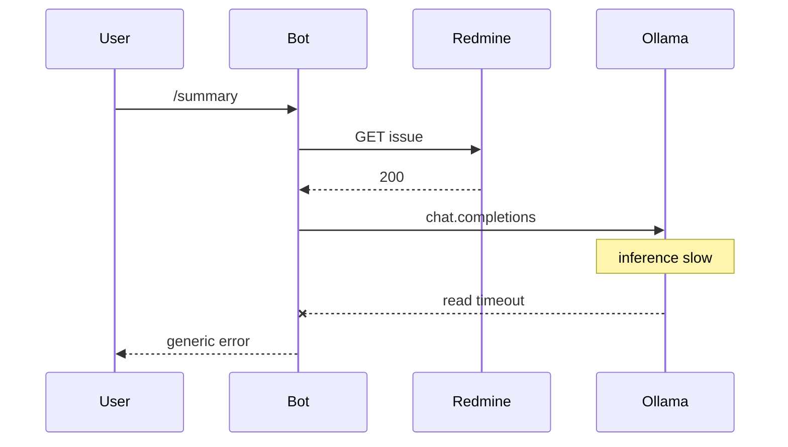

# Fix LLM timeouts, Discord warnings, and command logging

## Root cause of `/summary` failure

Logs show Redmine `**GET .../issues/7103.json` → 200**, then OpenAI SDK **retries** on `/chat/completions`, ending in `**httpx.ReadTimeout` → `APITimeoutError`**. So the bot and Redmine are fine; **Ollama did not complete the completion within the HTTP read timeout** (currently **120s** in `[ultron/llm.py](ultron/llm.py)` on `AsyncOpenAI(..., timeout=self.timeout)`). Large tickets + small local models on CPU often need **several minutes**.

## 1. Configurable LLM timeout (and optional retries)

- Extend `[ultron/settings.py](ultron/settings.py)` / `EnvSettings` with optional `**LLM_TIMEOUT_SECONDS**` (float/int), default **600** when `OLLAMA_API_BASE` is set or base URL looks like Ollama (`:11434`), else keep **120** for cloud APIs. Document in `[.env.example](.env.example)` and `[README.md](README.md)`.
- Pass timeout into `[LLMClient](ultron/lltron/llm.py)` from `[ultron/__main__.py](ultron/__main__.py)` when constructing `LLMClient`.
- Optionally add `**LLM_MAX_RETRIES`** (default **0** or **1** for Ollama, **2** for OpenAI) passed to `AsyncOpenAI(max_retries=...)` so a slow first attempt does not multiply wall-clock time with long per-try timeouts.

## 2. User-visible error for timeouts

- In `[ultron/bot.py](ultron/bot.py)`, import and catch `**openai.APITimeoutError`** (and optionally `**httpx.TimeoutException**`) in `summary_cmd` and `note_cmd`.
- Reply on Discord with a clear message (e.g. model took too long; suggest increasing `LLM_TIMEOUT_SECONDS` or using a faster model), instead of the generic “Something went wrong”.
- Keep `logger.exception` or `logger.warning` with issue id for operators.

## 3. Silence PyNaCl / davey warnings

Those lines come from `**discord.client**` at WARNING when voice extras are missing. Ultron does not use voice.

- In `[ultron/__main__.py](ultron/__main__.py)`, after `basicConfig`, set  
`logging.getLogger("discord.client").setLevel(logging.ERROR)`  
so startup stays clean without adding voice dependencies (avoids extra native deps per your “simple deploy” goal).

## 4. Structured command logging (terminal visibility)

- Use the existing `**ultron**` logger (or `logging.getLogger("ultron.commands")`) at **INFO**.
- In `**summary_cmd` / `note_cmd`** in `[ultron/bot.py](ultron/bot.py)`:
  - **Start**: log command name, `issue_id`, `interaction.user.id`, `guild.id` / DM, `channel.id`.
  - **After success paths**: log completion and output size (character count of reply), elapsed **seconds** via `time.monotonic()`.
- In `[ultron/workflows.py](ultron/workflows.py)` (or keep in bot only to minimize churn): optional **mid-step** logs — “fetched issue N, prompt ~X chars”, “calling LLM”, “LLM returned Y chars” — so the terminal shows **what Ultron is doing** between defer and followup.
- Optionally add env `**LOG_LEVEL`** (default `INFO`) in `__main__.py` to set root or `ultron` logger level for future debugging.
- Tone down noisy libraries if desired: e.g. `**httpx**` / `**openai**` at **WARNING** so retries do not spam INFO, while `**ultron`** stays INFO for command lines.

## 5. Optional hardening (if timeouts persist)

- Cap or trim ticket payload further in `[ultron/textutil.py](ultron/textutil.py)` (e.g. description/journals) if prompts are huge; only if needed after timeout increase.

## Files to touch

| File                                                      | Change                                                                                                                         |
| --------------------------------------------------------- | ------------------------------------------------------------------------------------------------------------------------------ |
| `[ultron/settings.py](ultron/settings.py)`                | Parse `LLM_TIMEOUT_SECONDS`, optional `LLM_MAX_RETRIES`; extend `EnvSettings`.                                                 |
| `[ultron/llm.py](ultron/llm.py)`                          | Accept `max_retries`; pass to `AsyncOpenAI`.                                                                                   |
| `[ultron/__main__.py](ultron/__main__.py)`                | Configure log levels (discord.client, optional httpx/openai); apply `LOG_LEVEL`; build `LLMClient` with new env-driven params. |
| `[ultron/bot.py](ultron/bot.py)`                          | Command audit logs; catch timeout exceptions; user-facing messages.                                                            |
| `[ultron/workflows.py](ultron/workflows.py)`              | Optional INFO logs for fetch/LLM steps.                                                                                        |
| `[.env.example](.env.example)` + `[README.md](README.md)` | Document new variables.                                                                                                        |

No plan file edits; implementation after you approve.